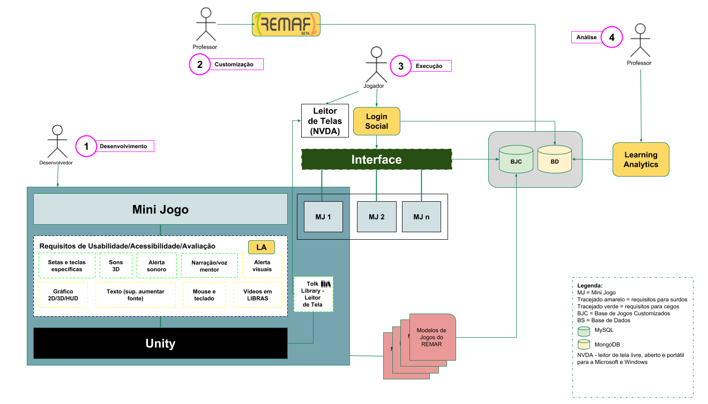

=========================
Arquiteturas relacionadas
=========================

Requisitos de Acessibilidade
============================

Os requisitos de acessibilidade foram levantados através de reuniões gerais das equipes, conversas com pessoas com deficiências (PCDs) envolvidas no projeto e revisão bibliográfica. Maiores detalhes podem ser encontrados `aqui <https://docs.google.com/document/d/1skEVpEKSFmfT8GxSOsrlR17pMRvjYdKt5VHvSEkFrxs/edit?usp=sharing>`_.

Audiodescrição
^^^^^^^^^^^^^^

É necessário que todo o conteúdo (cenário, minijogos, etc) tenha audiodescrição para os deficientes visuais. Dado essa necessidade, foram estudados maneiras diferentes de prover essa descrição. Uma primeira tentativa foi através de ferramentas Text-to-Speech, que faria a leitura dos conteúdos necessários. Para tal, utilizou-se a API do google que foi apresentado para testes com PCD visual que, após o teste, nos orientou a utilização dos leitores de tela, pois cada deficiente visual possui uma diferente voz do leitor, com diferentes velocidades, entre outros, e caso fosse utilizado o TTS, poderia acabar por afastá-los do jogo por problemas relacionados à voz.

Assim, para atender essa demanda, foi procurado por ferramentas ou bibliotecas que pudessem integrar a leitura de tela do computador com o jogo desenvolvido pelo Unity. A biblioteca Tolk resolve esse problema, permitindo utilizar o leitor instalado no computador para a leitura dos textos do jogo. Porém, só foi possível utilizar essa biblioteca, até o momento, em jogos desktop com sistemas operacionais windows (não foi testado para linux e mac).

Som binaural
^^^^^^^^^^^^

O som binaural (3D) é um requisito para ajudar na localização dos deficientes visuais ao decorrer do jogo. Ou seja, sons que permitem saber se algum objeto/animal está próximo ou longe, a direção que ele está, entre outros. Com a ajuda do Otávio, foram dadas sugestões de como implementar da melhor maneira esses detalhes (som estático para objetos, apontar a direção (Norte, sul, por exemplo) do personagem, entre outros). A princípio, as ferramentas do unity estão suprindo essa demanda, porém com o decorrer do desenvolvimento do jogo, novos requisitos ou novas metodologias para implementação podem surgir.

Libras
^^^^^^

Para libras, em um primeiro momento foi discutido a utilização de avatares para realizar a tradução. Entretanto, devido à implementação dos avatares (`vlibras <http://www.vlibras.gov.br/>`_, por exemplo) não estar completamente terminada e aprimorada, optou-se pela utilização de vídeos gravados por intérpretes de libras para a tradução.

Esses vídeos serão executados via unity através de seu player nativo. Uma questão que ainda está em discussão é sobre como o vídeo será executado, seja via streaming ou não (o vídeo estaria dentro da pasta do jogo).

Navegação/Usabilidade
^^^^^^^^^^^^^^^^^^^^^

A navegação e usabilidade do jogo tem  que ser inclusiva e acessível. Para isso, teclas de atalho serão implementadas para que o jogo possa ser jogado apenas através do teclado (sem utilizar o mouse), o jogo terá audiodescrição e atalhos para leitura dos textos que forem exibidos e também a tradução do conteúdo para libras. Ademais, serão implementados alertas visuais e sonoros para as ações e eventos do jogo.

Outros requisitos podem surgir ao decorrer do desenvolvimento que serão incorporadas para se melhorar a usabilidade do jogo.

Glossário
^^^^^^^^^

Necessário ter três glossários:

- Português e libras: textos (palavra e explicação), imagem (e descrição), vídeos em libras (da palavra e da explicação).

- Inglês: textos em inglês (palavra), som (caso possua), imagem.

- Dicionário de sons: texto, som (palavra e descrição).

É Preciso ter busca pelo texto (ou libras, através do sinal), no qual retorna as instâncias que estão descritas acima, dependendo do glossário utilizado. Algumas outras funcionalidades ainda estão em discussão, como por exemplo a busca dos textos por cenário e descrição dos textos/imagens em inglês.

Arquitetura do desenvolvimento do jogo
=======================================

O histórico de desenvolvimento da arquitetura pode ser encontrada na seguinte `apresentação <https://docs.google.com/presentation/d/1VsvHcXpbeVZJpwS-NAaXeZEkLGBHVKt7u_825CdEKsc/edit?usp=sharing>`_. A atual versão pode ser vista na :numref:`figarquitetura`.

.. _figarquitetura:

    : Arquitetura do desenvolvimento

