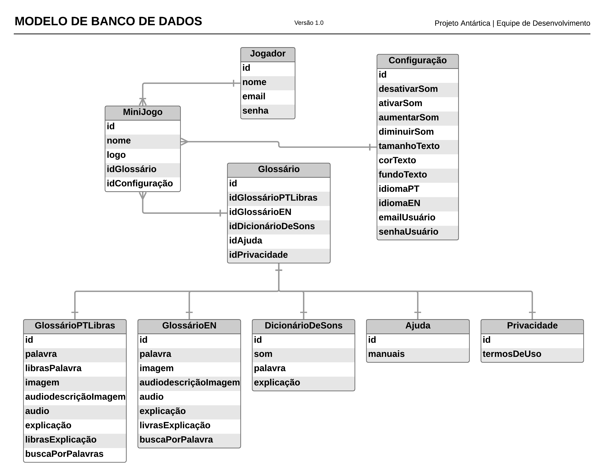

===================================
Modelagem inicial do banco de dados
===================================

A :numref:`figBD` mostra o diagrama entidade relacionamento na notação Oracle, contendo as relações iniciais de cadastro, glossário e configurações do jogo.

.. _figBD:

   : Modelagem Inicial de Banco de Dados
