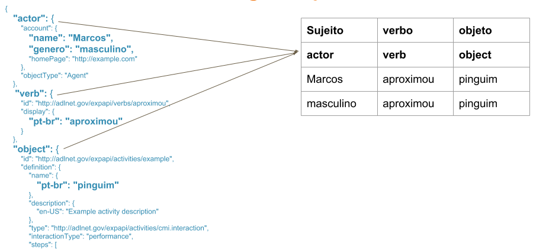

==================
Tecnologias usadas
==================

Tópico relacionado à tomada de decisões das tecnologias, ferramentas, bibliotecas, etc. que serão utilizadas no desenvolvimento do projeto.

Game Engine
===========

Para a escolha da engine a ser usada no desenvolvimento do jogo, foi realizada uma análise comparativa entre 15 engines baseada nos critérios e pontuações do framework de Ali e Usma (2016). As engines foram rankeadas e as cinco mais pontuadas foram: Cocos2D, Godot Egine, Unreal Engine 4 e Unity 3D. Estas cinco engines selecionadas foram testadas observando os atributos específicos selecionados de acordo com as necessidades do Projeto Antártica, são eles: (i) requisitos de acessibilidade (sons 3D, player de vídeo/youtube, gáfico 2D/3D); (ii) learning analytics; (iii) reuso de minijogos e interação com a plataforma REMAR; (iv) suporte da empresa e comunidade (tutoriais, fóruns, documentação). Após os testes, a Unity3D foi escolhida para o desenvolvimento do jogo, principalmente, por ter uma documentação atualizada e um grande suporte à comuniadade, além de que atendeu à maioria dos atributos específicos comparados. A análise comparativa das 15 engines, tal como os testes das 5 selecionadas estão disponíveis `aqui <https://docs.google.com/spreadsheets/d/1HZr2qw1VU1hxQHMUvvzoJUTteoh7uYQtHIbmS9KSBJc/>`_.

Learning Analytics
==================

Ainda não foi definida a tecnologia a ser usada. :doc:`Testes <testes_iniciais>` foram realizados com GBLxAPI e RAGE, 
ambos utilizam o padrão xAPI como especificação dos dados gerados.

xAPI
^^^^

Experience API (ou xAPI) é uma nova especificação para tecnologia de aprendizado que possibilita 
a coleta de dados de experiências que uma pessoa tem (online e offline).

**Como funciona a xAPI?**

É possível aprender a partir de qualquer forma experiência, então registrar essas experiências é algo importante.
Os registros seguem a estrutura “Sujeito, verbo, objeto” (:numref:`figxAPI`) são armazenados em um Learning Record Store (LRS).
O uso “Sujeito, verbo, objeto” permite Liberdade de declaração,  é quase um diário do usuário. Registros são 
ativados por eventos, clique de botão, colher itens, sair da aplicação, etc.

.. _figxAPI:

   
   : Dados do xAPI utilizando a estrurua “Sujeito, verbo, objeto”.

Os LRS registram todas as declarações feitas. Um LRS pode compartilhar essas instruções com outros LRSs. Um LRS pode 
existir sozinho, :numref:`figLRSisolado`, ou dentro de um LMS (Learning Management System), :numref:`figLRSLMS`.

.. _figLRSisolado:
.. figure:: https://2j6vh43zoo92z7qif3oiqt2l-wpengine.netdna-ssl.com/wp-content/uploads/sites/3/2018/07/ecosystem-standalone-500x375.png
   :align: center

   : LRS isolado (Fonte: https://xapi.com/).

.. _figLRSLMS:
.. figure:: https://2j6vh43zoo92z7qif3oiqt2l-wpengine.netdna-ssl.com/wp-content/uploads/sites/3/2018/07/ecosystem-inlms-500x375.png
   :align: center

   : LRS dentro de um LMS (Fonte: https://xapi.com/).

Acessibilidade
==============

Os requisitos de acessibilidade estão descritos com mais detalhes na `seção 3.1 <https://doc-game-antartica.readthedocs.io/pt_BR/master/doc2.4/arquiteturas_relacionadas.html#requisitos-de-acessibilidade>`_. As ferramentas que visam atender esses requisitos são: as ferramentas nativas do unity para execução de vídeo (libras, por exemplo) e para o som binaural (som ambiente, passos, por exemplo). A codificação de teclas de acesso para aprimorar a navegação e usabilidade também será feita através do unity. É possível que seja necessário utilizar algum asset da unity para eventuais melhorias do desenvolvimento.

Para a questão da audiodescrição, foi escolhida a biblioteca `Tolk <https://github.com/dkager/tolk>`_ que permite a detecção dos leitores de tela instalados no computador do usuário e, através dele, faz a leitura dos textos do jogo (que necessitam ser lidos pelo leitor, pois haverá textos que serão gravados, i.e., não necessitam do leitor de tela).

Customização
============

A customização do jogo será feita através da plataforma REMAR. O REMAR (Recursos Educacionais Multiplataformas Abertos na Rede) é uma plataforma de apoio à publicação e customização de jogos educacionais abertos. Oferece um conjunto de ferramentas que possibilitam: (i) a publicação de modelos de jogos customizáveis com a licença aberta Creative Commons; (ii) a customização de jogos por professores ou alunos, a partir dos modelos de jogos educacionais publicados; (iii) a integração com repositórios digitais para a publicação e busca de itens de customização; (iv) a geração de versões dos jogos customizados para diferentes plataformas (web, desktop, móvel); (v) acompanhamento do progresso dos alunos durante o uso dos jogos educacionais. 

Referências
============

Ali, Z.; Usman, M. (2016). "A framework for game engine selection for gamification and serious games". Future Technologies Conference (FTC), San Francisco, CA, 2016, pp. 1199-1207.

RAGE. Disponível em: `<http://rageproject.eu/>`_. Acesso em: 21 de Dez. de 2018.

REMAR. Disponível em: `<http://remar.dc.ufscar.br/index/apresentacao>`_. Acesso em: 21 de Dez. de 2018.

Unity. Disponível em: `<https://unity3d.com/pt>`_. Acesso em: 21 de Dez. de 2018.

xAPI. Disponível em: `<https://xapi.com/overview/>`_. Acesso em: 21 de Dez. de 2018. 
