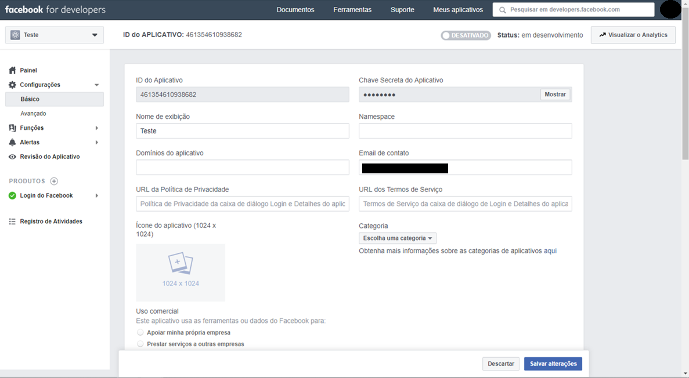
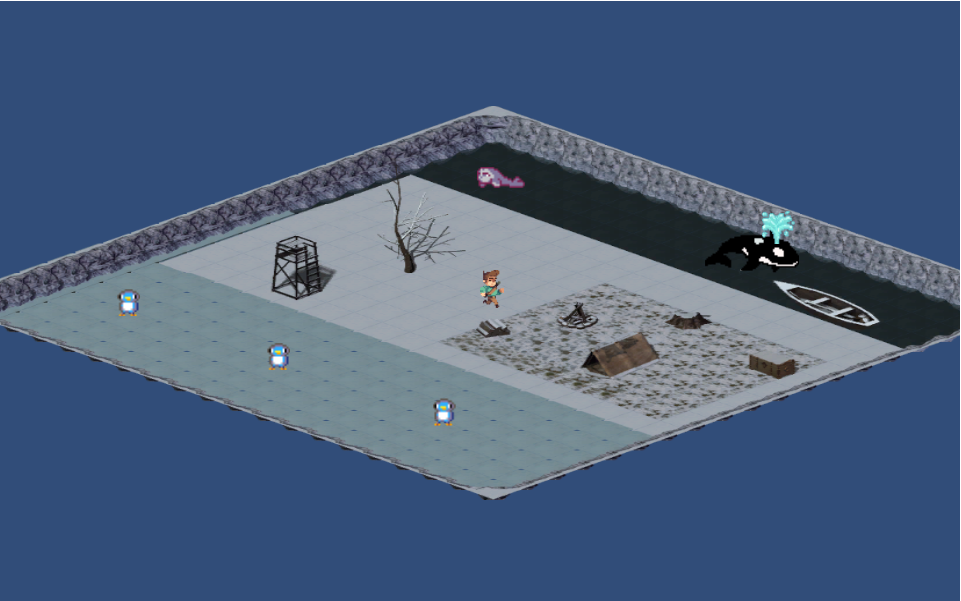
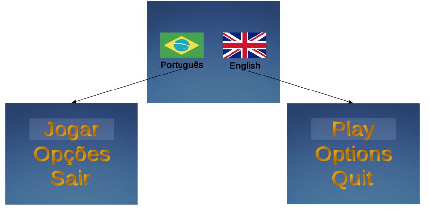
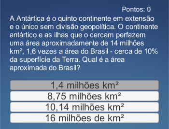

===============
Testes iniciais
===============

Os testes realizados estão disponibilizados no `github <https://github.com/Projeto-Game-Antartica/testes-ferramentas>`_ da organização do projeto no repositório de Testes.

Identificação dos Usuários de Teste
====================================

Atualmente, os usuários que compõem o grupo de testes são:

	**- Aluno 1**: Graduando em Ciência da Computação pela Universidade Federal do ABC. Deficiente visual. Consultor do projeto para parte de acessibilidade.

	**- Funcionário 1**: Funcionário da Universidade Federal do ABC. Deficiente visual.

Sistema de Login
================

Testes com a API de autenticação de login. 

Usuário utiliza o e-mail e senha para registrar-se. Pode vincular sua conta com alguma rede social (ex.: Facebook) para utilizar a autenticação por "1-click".

Projeto utilizado nos testes: https://github.com/scotch-io/easy-node-authentication

A API  utiliza as tecnologias NodeJS e MongoDB. O administrador da plataforma necessita ter uma conta de desenvolvedor na rede social correspondente
para disponibilizar os recursos de login com "1-click".

Para configurar a autenticação pelo facebook, por exemplo, criamos uma conta de desenvolvedor no Facebook (:numref:`figfacedev`),
criamos um produto **login do Facebook**, anotamos a **ID do Aplicativo** e a **chave secreta**. 
Acessamos o arquivo **'config/auth.js'** (:numref:`codefacebookauth`) inserimos a ID do Aplicativo no campo **'clientID'** e Chave seceta em 
**'clientSecret'**.

.. _figfacedev:

   
   : Conta do Facebook desenvolvedor.

.. _codefacebookauth:
.. code-block:: javascript
    :caption: Configuração para uso da autenticação pelo Facebook.
    :emphasize-lines: 2,3
    :name: config/auth.js

    'facebookAuth' : {
        'clientID'        : '461354610938682', // your App ID
        'clientSecret'    : '5ad144d13582', // your App Secret
        'callbackURL'     : 'http://localhost:8080/auth/facebook/callback',
        'profileURL': 'https://graph.facebook.com/v2.5/me?fields=first_name,last_name,email',
        'profileFields'   : ['id', 'email', 'name'] // For requesting permissions from Facebook API

    },

    

REMAR
=====

Disponível `aqui <https://github.com/Projeto-Game-Antartica/testes-ferramentas/tree/master/Antartica_Remar>`_. 

Learning Analytics
==================

GBLxAPI
^^^^^^^^

Está de acordo com o K-12,  é uma designação para a educação primária até a educação secundária, padrão usado nos EUA e Canadá.
Está em beta. Utiliza interface para realizar a comunicação entre LRS e os Jogos feitos em Unity.

Exemplo de dashboard: 
https://gblxapi.org/images/analytics/GBLxAPI_Demo2-8-17-2018.png

Plataforma RAGE: https://github.com/e-ucm/rage-analytics
^^^^^^^^^^^^^^^^^^^^^^^^^^^^^^^^^^^^^^^^^^^^^^^^^^^^^^^^^^^^^^^^

**R** ealising an **A** pplied **G** aming **E** cosystem é ecossistema dividido em três camadas, conforme :numref:`figRAGEarch`.

.. _figRAGEarch:
.. figure:: https://user-images.githubusercontent.com/5657407/28160045-4a483136-67bf-11e7-941e-2db0cd786869.png
   :align: center
   
   : Visão da arquitetura RAGE em três camadas (Cliente, Autenticação/Autorização e Aplicações).

**Cliente**

Acesso ao jogador e rastreia os jogos. Front-end do analytics permite acesso aos desenvolvedores, 
professores e estudantes. A2 front-end permite o administrador gerencia as contas dos usuários.

**A2**

Módulo A2 controla autenticações e autorizações de usuários e tráfego das informações. Pelo A2 é possível gerenciar 
usuários, papéis, recursos, permissões e aplicações.

**Aplicações**

Experience API (xAPI) é usado como padrão para o rastreio de dados do usuário. O analytics back-end armazena 
as informações obtidas através da A2. Kafka mantém filas de rastreios a serem processadas. Topologia Storm 
gerencia a análise de processos. Os resultados são armazenados no ElasticSearch. Kibana gerencia as visualizações 
dos resultados via ElasticSearch.

Acessibilidade
==============

Para o teste relacionado à acessibilidade, foram criado dois projetos distintos, um para `teste de sons e vídeo <https://github.com/Projeto-Game-Antartica/testes-ferramentas/tree/master/snow_tile>`_ e outro para a `leitura de tela, navegação, mini-jogos e também o glossário. <https://github.com/Projeto-Game-Antartica/testes-ferramentas/tree/master/translation-project>`_

Sons e Vídeo
^^^^^^^^^^^^

Os testes relacionados à sons e vídeos foram utilizados para testar as ferramentas do Unity com objetivo de verificar se seriam suficientes para contemplar os requisitos de acessibilidade. A parte de vídeo não foi testada com nenhum usuário, porém as funcionalidades da engine permitem que sejam feitas a execução de vídeo normalmente. Ainda existe a dúvida de como a execução será feita, se através de streaming ou não, visto que isso pode impactar no tamanho do jogo final (os vídeos podem ou não estar dentro da pasta do jogo, aumentando o seu tamanho).

O teste de som foi realizado com o Aluno 1 e o Funcionário 1, onde foram apresentados um cenário 2D isométrico (:numref:`figIsometricScene`) com diferentes tipos de chão (gelo, neve, etc) e diferentes animais espalhados pelo mapa. O objetivo era de saber se era possível localizar os animais e supor a distância que os mesmos estavam do personagem. Cada tipo de chão possuía um som característico, bem como os animais. Além disso, havia som de colisão com as paredes (cenário fechado).

O feedback dos testes foi positivo, porém com sugestões de melhorias e, dentre elas, pode-se destacar: transição mais suave dos sons (para ajudar na localização/distância dos animais, no caso), sons estáveis para objetos (por exemplo, caso haja uma parede ao norte do usuário, emitir um som estático característico representando essa situação).

.. _figIsometricScene:

   
   : Cenário 2D isométrico utilizado para teste.

Leitura de tela
^^^^^^^^^^^^^^^

A leitura de tela foi apresentado através de um teste em formato de um quiz (minijogo). Assim, foi desenvolvido uma mecânica simples de transição de telas (menu, jogo, créditos) para também testar a usabilidade e navegação do jogo. 

Todo o conteúdo foi adaptado para que pudesse ser lido e relido pelo leitor de tela nativo do computador (sAPI, NVDA, por exemplo). Além do conteúdo exposto na tela, foram adicionados textos de instruções "invisíveis" ao usuário, i.e., textos que eram lidos a cada transição de tela para explicar detalhes de navegação (teclas de atalho) mas que não eram exibidos.

O teste foi realizado com o Aluno 1 que nos deu um feedback positivo, além de mais sugestões para melhoria da navegabilidade, como por exemplo adicionar sons para representar o início/final das alternativas (quiz) e teclas de atalho para repetirem o último texto lido.

Além disso, foi testado também a tradução do jogo, ou seja, o jogo foi apresentado em dois idiomas com opção de escolha na primeira tela.

As telas podem ser vistas na :numref:`figTraducao` e :numref:`figQuiz`.

.. _figTraducao:

   
   : Tela inicial com seleção de idioma.

.. _figQuiz:

   
   : Quiz.
   
Glossário
^^^^^^^^^

O teste de glossário é uma opção adicionada ao projeto anterior (leitura de tela) na tela de menu, que constará os três glossários necessários. Essa etapa ainda está em desenvolvimento.

O conteúdo do glossário para realização do teste pode ser encontrado `aqui <https://docs.google.com/spreadsheets/d/1mvGuemPk3e-Gm60rgdjMvQxMZGOjmYUOElkMYs2TA3c/edit?usp=sharing>`_.
