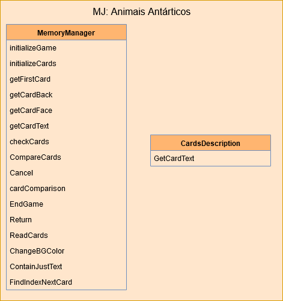

======================================
Minijogos
======================================

Teia alimentar
===============

.. _figteia:
.. figure:: ./assets/teia.png
   :align: center
   
   : Classes que são utilizadas para desenvolvimento minijogo da teia alimentar.

Animais Antárticos
====================

.. _figmemoria:

   
   : Classes que são utilizadas para desenvolvimento minijogo da memória (animais antárticos).

Fotoidentificação
==================

.. _figteia:
.. figure:: ./assets/fotoidentificacao.png
   :align: center
   
   : Classes que são utilizadas para desenvolvimento minijogo da fotoidentificação de caudas.