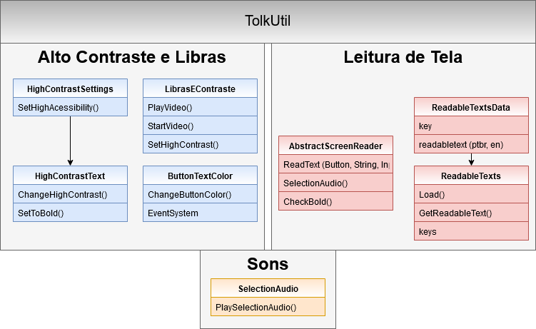

======================================
Acessibilidade
======================================

Aqui serão descrito os itens de acessibilidade desenvolvidos no jogo Expedição Antártica. Detalhes de implementação serão tratadas nesta seção.

A acessibilidade do jogo está dividida nas seguintes partes: alto contraste, libras, sons do jogo e alto contraste.

As classes *.cs* responsáveis por essas partes são encontradas na figura :numref:`figacessibilidade`.

.. _figacessibilidade:

   
   : Classes que são utilizadas para desenvolvimento da acessibilidade do jogo.

Alto Contraste
==================

O alto contraste do jogo refere-se à alteração do fundo e a cor da fonte dos textos para preto e branco, respectivamente. As imagens de dentro do jogo não sofrem alteração. 

Para isso, existem duas classes principais que realizam a alteração de contraste dentro do jogo e um *prefab* contendo um componente textual.

As classes são: *HighContrastSettings.cs* e HighContrastText.cs. A primeira tem como responsabilidade de apenas alterar a variável booleana de "ALTO CONTRASTE" do jogo, isto é, os botões ou *toggles* que ativam o alto contraste, o fazem através dessa classe. A segunda é responsável pela alteração das cores do texto e fundo e também por ativar o negrito, se necessário. Assim, caso haja alguma alteração do parâmetro, fica a cargo da classe HighContrastText verificar essa alteração e alterar as cores de acordo com o fundo. O prefab utilizado consiste de uma imagem com um filho contendo texto. Assim, é alterada a cor da imagem de fundo para preto e o texto para branco quando ativado o alto contraste. É feito dessa maneira pois não há maneira de grifar o texto do unity. 

Uma outra classe auxiliar que faz a alteração do contraste dos botões do menu principal quando os mesmos estão selecionados é ButtonTextColor. Ela é necessária, pois quando o botão é selecionado, sua cor é alterada e o texto fica com um contraste baixo dificultando a leitura. Assim, essa classe implementa algumas interfaces de EventSystem para registro de callbacks para determinadas ações, são elas: ISelectHandler, IPointerEnterHandler, IPointerClickHandler, IDeselectHandler, IPointerExitHandler. Portanto, quando um botão é selecionado sua cor é alterada e quando o foco não está nele, o mesmo retorna ao seu estado normal.

Libras
==================

A tradução em libras é feita através da execução do vídeo do intérprete em locais adequados de acordo com a interface. Esse vídeo é executado através do script LibrasEContraste.cs. Nela contém métodos que ativam um fundo e nesse fundo é executado o vídeo em libras.

Esse script está anexado a um prefab de libras, que contém o component VideoPlayer do Unity para a execução. É possível alterar os vídeos via script.

Leitura de Tela
==================

A leitura de tela não é possível de ser feita automaticamente pelo Unity, pois os leitores de tela não conseguem acessar o jogo em si. Assim, foi possível utilizar de uma biblioteca externa que pudesse reconhecer os leitores de tela para que a leitura possa ser feita durante o jogo. Essa biblioteca chama-se `Tolk <https://github.com/dkager/tolk>`_.

A classe base para a leitura de tela é a TolkUtil.cs que está responsável por utilizar da biblioteca *Tolk* para identificar os leitores de telas ativos e ativá-los durante o jogo.

A leitura de tela do jogo pode ser dividida em duas frentes: A audiodescrição (texto) e a leitura pelo jogo.

Audiodescrição (texto)
^^^^^^^^^^^^^^^^^^^^^^

Para o armazenamento dos textos da audiodescrição é utilizado um arquivo do tipo *json*. Esse arquivo *json* é mapeado para a classe ReadableTextData.cs. Assim, através da classe ReadableTexts.cs é possível carregar o arquivo json e mapeá-lo numa classe .cs e, então, é possível acessar esses textos através de *keys* específicas.

Leitura
^^^^^^^^^^^^^^^^^^^^^^
A leitura do jogo é feita através da classe abstrata AbstractScreenReader.cs, onde nela contém metodos que possibilitam a leitura do texto (para os mais diversos tipos, isto é, texto, botão, input, toggle, etc) quando o parâmetro "LEITURA DE TELA" está ativado. Portanto, as classes do jogo que precisam fazer a leitura da tela do jogo precisam herdar esses métodos dessa classe.

Sons do Jogo
==================

Para os sons do jogo, de uma maneira geral, é feito através da configuração dos componentes AudioSource do Unity, para que se torne um som 3D para melhor imersão. Porém, nesse caso, é preciso de um script que seja utilizado para sons de efeito de ações da interface, por exemplo. Nesse caso, o script SelectionAudio.cs é responsável por executar áudios de transição de teclas, isto é, quando a navegação é feita via teclado a cada seleção de tecla é executado um som específico para isso. Este som (e os demais do jogo) pode ser encontrado no dicionário de sons do jogo.