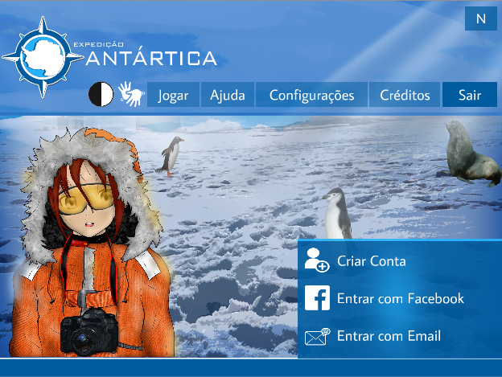
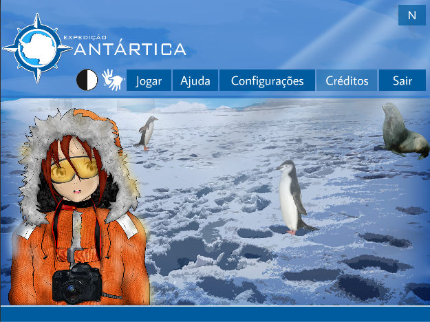
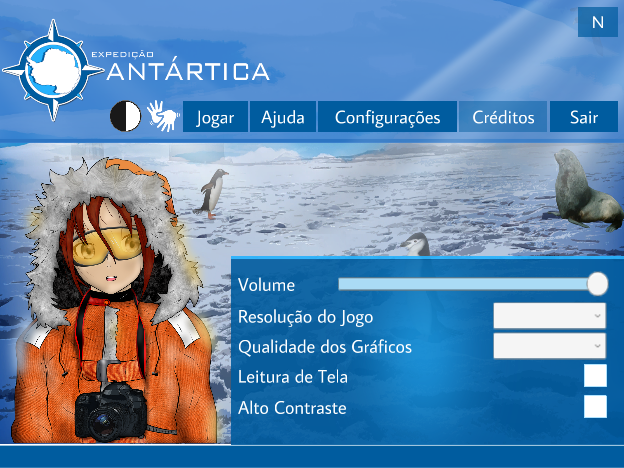
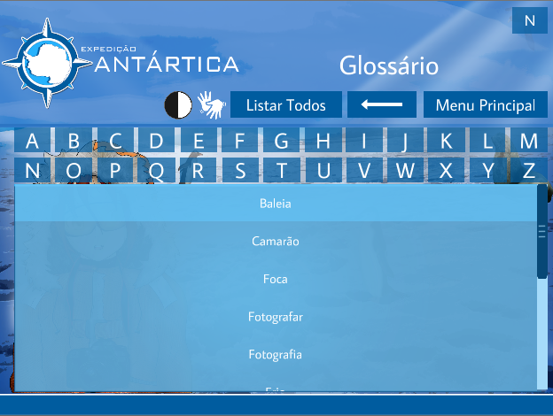
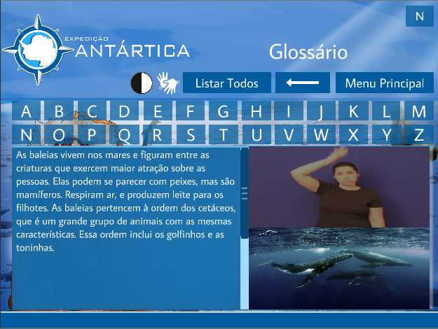

======================================
Itens
======================================

A seguir serão destacados os detalhes da implementação de cada item de pré-jogo além das suas respectivas interfaces.

Antes da execução do jogo, a funcionalidade de localização (português e inglês) é executada através das classes LocalizationManager.cs e StartupManager.cs. É feito a leitura de um arquivo *json* contendo uma *chave* e *descrição* e adicionado na classe de mapeamento LocalizationData.cs. E para a localização dos textos é adicionado ao GameObject uma classe chamada LocalizedText.cs que mapeia o texto através de uma chave para seu correspondente texto no idioma escolhido. Porém, ainda não se sabe, efetivamente, se haverá uma tradução do jogo.

Cadastro
========

A tela de cadastro pode ser visto na figura :numref:`figfacedev`. A implementação da interface ainda está em desenvolvimento, junto com o banco de dados e a parte de login.

.. _figcadastro:

   
   : Interface da tela de cadastro.

Login
========
A tela de login pode ser encontrada na figura :numref:`figlogin`. A implementação ainda está em desenvolvimento. As funcionalidades previstas estão logins via e-mail institucional e também via facebook e email.

.. _figcadastro:

   
   : Interface da tela de login.

Menu principal
========

O menu principal contém o menu de ajudas e de configurações. Temos as seguintes classes .cs principais: (a) MainMenu, (b) OptionMenu, (c) HelpMenu

(a) Responsável pelo controle dos botões da interface de menu principal (vide figura :numref:`figmenuprincipal`). É responsável também pelo controle da barra de carregamento para o jogo.

.. _figmenuprincipal:

   
   : Interface do menu principal.

(b) Responsável pelas opções do jogo. Que são: controle de volume, resolução, qualidade dos gráficos, leitura de tela e alto contraste. A interface pode ser vista na figura :numref:`figmenuopcoes`. Os parametos de acessibilidade são **estáticos** (classe Parameters.cs, será explorada mais pra frente), e então são controlados através de *Toggles*. O volume encontra-se alocado dentro de um *mixer* (ainda com apenas um canal master) e controlado através de um *Slider*. Para a qualidade de gráficos e resolução, temos uma classe auxiliar ResolutionQualityController.cs que cuida dessas alterações através de um *DropDown*.

.. _figmenuopcoes:

   
   : Interface do menu com o menu de opções habilitado.

(c) Essa classe controla a transição de cenas (funcionalidade dos botões) pelas opções de ajuda do jogo que, por enquanto, são: áudios e glossário em libras (vide figura :numref:`figmenuhelp`).

.. _figmenuopcoes:

   
   : Interface do menu com o menu de ajuda habilitado.

Glossário em libras
========

O glossário em libras, requisito de acessibilidade, foi desenvolvido visando auxiliar os surdos. A interface do glossário pode ser visto na figura :numref:`figlibras1`. O funcionamento do glossário é através da leitura de um arquivo *json*, mostrando as suas informações na tela. As classes principais são: DictionaryButton.cs e DictionaryController.cs. Para o modelo, é utilizado a classe DictionaryData (que serve para ambos os glossários) que faz o mapeamento do arquivo *json* para uma classe *C\#*, contendo os parâmetros: key_ptbr, key_en, description_ptbr, descrpition_en, image_path, video_path, audio_path que, representa, respectivamente, a chave em portugues e ingles, sua descrição (portugues e inglês) e os caminhos dos arquivos para o local de armazenamento das imagens, vídeos e audios.

.. _figlibras1:

   
   : Interface do glossário em libras.

A classe DictionaryButton representa o controle dos botões da lista vistos na figura :numref:`figlibras1`. Ao clicar num desses botões, é aberto uma nova interface contendo as informações (referentes ao arquivo *json*) relacionadas com a palavra. A interface pode ser vista na figura :numref:`figlibras2`.

.. _figlibras2:

   
   : Interface do conteúdo do glossário em libras.

A classe DictionaryController está responsável pelo controle direto do glossário, isto é, de ler o arquivo *json* e mapear num objeto e apresentar o seu conteúdo corretamente. O método **LoadDictionary** faz a leitura e mapeamento do *json*. Os métodos **AddButton**, **ShowAllButtons**, **ShowButtonStartingWithLetter(string letter)** estão responsáveis pelo controle da adição e filtro dos botões da tela :numref:`figlibras1`. O método **ShowDescriptionContent** está responsável por mostrar o conteúdo adequadamente como visto na figura :numref:`figlibras2`, como conteúdo, vídeo de libras e a imagem. Há a existência de outros métodos auxiliares para os métodos anteriores.

Glossário de sons (dicionário de sons)
========

O funcionamento desse glossário é semelhante ao do glossário em libras, é utilizado a mesma classe de modelo (DictionaryData) e as suas classes principais são SoundButton e SoundGlossaryController. A interface é semelhante a vista na figura :numref:`figlibras1`, com a exceçção de que quando se clica no botão é executado o áudio referente àquela palavra.