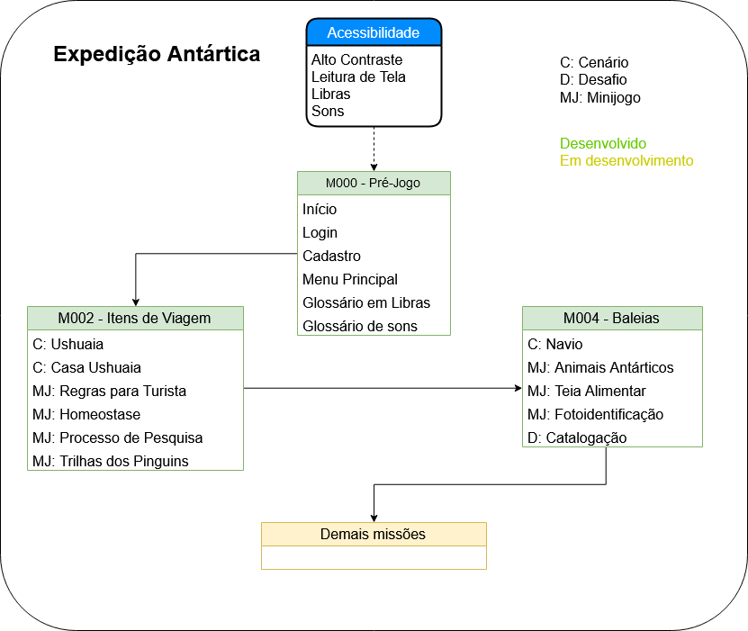

======================================
Expedição Antártica
======================================

O jogo Expedição Antártica é um jogo educacional do tipo RPG com 5 missões em 3 diferentes cenários. Inicialmente, têm-se a seguinte estrutura do jogo: Pré-jogo, M002 Baleias, M002 - Itens de Viagem e demais missões.

.. _figestrutura:

   
   : Arquitetura do jogo com as diferentes telas.

Na figura :numref:`figestrutura` é possível visualizar a arquitetura do jogo e suas transições. Até o presente momento tem-se desenvolvido as fases pré-jogo, M002 e M004. Os itens de acessibilidade se localizam na parte superior com setas pontilhadas representando que é herdado pelas demais cenas, isto é, está presente em todas as etapas do jogo. As "demais missões" estão em desenvolvimento e serão atualizadas neste documento quando estiverem finalizadas.